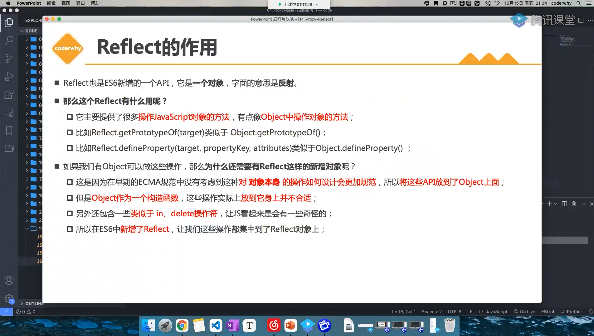
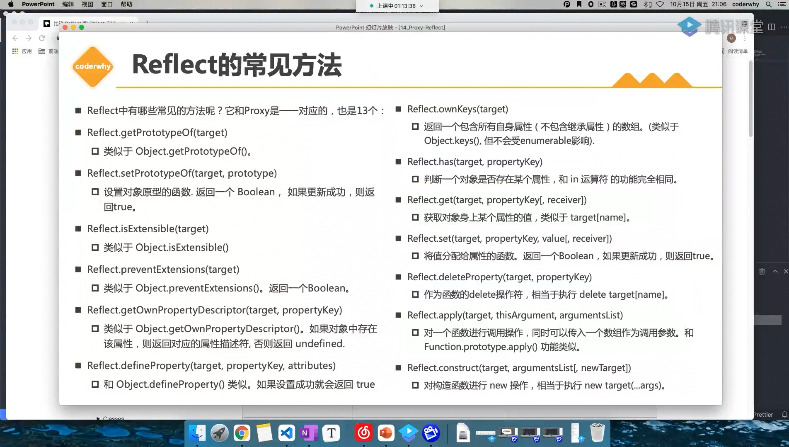

# 04_Reflect的作用和Proxy同时使

> `01:00:39`

|本期版本|上期版本
|:---:|:---:
`Thu Oct 12 18:19:36 CST 2023` | -


```javascript
target[key] = newValue;
Reflect.set(target, key, newValue);
```





## Ref

* [Proxy是代理，Reflect是干嘛用的？](https://www.zhangxinxu.com/wordpress/2021/07/js-proxy-reflect/)